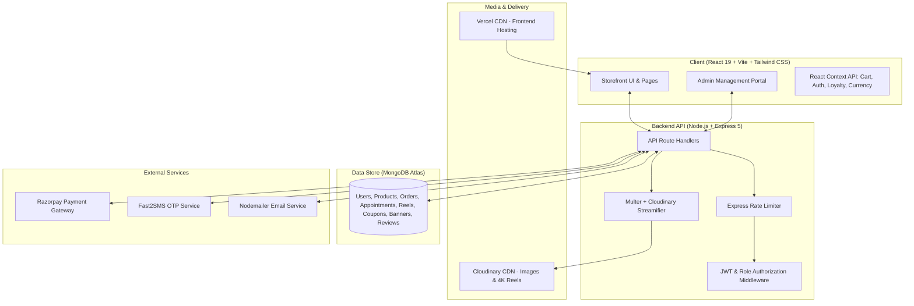

# ✨ Ethnique — Luxury Indian Ethnic Wear & Heritage Boutique

<div align="center">

[](https://ethnique.vercel.app/)
[](https://react.dev/)
[](https://nodejs.org/)
[](https://www.mongodb.com/)
[](https://tailwindcss.com/)
[](https://cloudinary.com/)
[](https://razorpay.com/)

**From The House of Jayant Saree Center — 25+ Years of Retail Craftsmanship**  
*A modern digital haute couture destination bringing Banarasi silks, Kanjeevarams, Chanderis, bridal trousseaus, and bespoke drape consultations to patrons worldwide.*

[🌐 Explore Live Website](https://ethnique.vercel.app/) • [📦 API Server Endpoint](https://ethnique-api.onrender.com/api) • [✨ View Features](#-key-features) • [🚀 Quick Start](#-getting-started)

</div>

---

## 📖 Table of Contents

- [Overview & Heritage](#-overview--heritage)
- [Live Deployments](#-live-deployments)
- [Key Features](#-key-features)
  - [Customer Experience](#1-customer-experience)
  - [Admin Management Portal](#2-admin-management-portal-admin)
- [System Architecture](#-system-architecture)
- [Technology Stack](#-technology-stack)
- [Project Directory Structure](#-project-directory-structure)
- [Data Models & Database Schema](#-data-models--database-schema)
- [API Reference](#-api-reference)
- [Environment Variables](#-environment-variables)
- [Getting Started](#-getting-started)
  - [Prerequisites](#prerequisites)
  - [Backend Setup](#backend-setup)
  - [Frontend Setup](#frontend-setup)
  - [Default Admin Credentials](#default-admin-credentials)
- [Deployment Guide](#-deployment-guide)
  - [Frontend on Vercel](#frontend-on-vercel)
  - [Backend on Render](#backend-on-render)
- [Security & Performance](#-security--performance)
- [Contributing & License](#-contributing--license)

---

## 🏛️ Overview & Heritage

**Ethnique** is a full-stack, enterprise-grade luxury e-commerce platform developed for **Jayant Saree Center**, a legacy brand with over **25 years of heritage** in curating authentic Indian ethnic wear. 

Combining traditional royal aesthetics with modern web technologies, Ethnique delivers a high-touch boutique shopping experience online:
- **Artisanal Weaves**: Pure handloom Banarasi silk, Kanjeevaram brocades, Chanderi silks, Organza florals, Paithani, and festive bridal wear.
- **Interactive Video Shopping (Shoppable Reels)**: Watch authentic drape flows, model walk-throughs, and fabric sheen in real-time video, with instant one-click product purchase options.
- **Bespoke Consultations**: Book in-store private styling sessions or virtual video drape consultations for weddings and milestone celebrations.
- **Royal Privilege Club**: Customer loyalty ecosystem featuring tier advancement (Insider, Elite, Ultimate), bonus points claims, and checkout redemptions.
- **Global Accessibility**: Multi-currency conversion (INR, USD, EUR, GBP, AED, CAD), multi-address shipping, and international-ready checkout flows.

---

## 🌐 Live Deployments

| Component | Provider | Live URL | Description |
| :--- | :--- | :--- | :--- |
| **Storefront Web App** | **Vercel** | [https://ethnique.vercel.app/](https://ethnique.vercel.app/) | Production client built with React 19, Vite, and Tailwind CSS |
| **REST API Server** | **Render** | [https://ethnique-api.onrender.com/api](https://ethnique-api.onrender.com/api) | Production Node.js & Express 5 API connected to MongoDB Atlas |
| **Media Delivery** | **Cloudinary** | Cloud CDN | Scalable image optimization and video streaming pipeline |
| **Payment Gateway** | **Razorpay** | Secured Gateway | Live / Sandbox card, UPI, net banking, and wallet transactions |

---

## ✨ Key Features

### 1. Customer Experience

- **Royal Heritage Design System**:
  - Bespoke royal backdrop animations (`AnimatedRoyalBackdrop`), gold trim accents, and handcrafted serif & sans typography.
  - Interactive theme switcher with persistent styling cues and fluid responsiveness across mobile, tablet, and desktop.
- **Shoppable Video Reels (`/reels`)**:
  - Immersive vertical video feed showcasing sarees draped in motion, fabric texture close-ups, and styling guides.
  - Direct "Buy Now" / "View Product" overlay modals right on the playing video.
- **Comprehensive Product Catalog (`/products`)**:
  - Multi-attribute filtering: Category (Banarasi, Kanjeevaram, Organza, Cotton, Silk, etc.), Price Range, Color, Fabric, and Stock Availability.
  - Fast search by keyword, weave title, or SKU.
  - Sorting by Price (Low-to-High / High-to-Low), Newest Arrivals, and Popularity.
- **Product Detail & Customization (`/products/:id`)**:
  - High-definition image zoom gallery and showcase videos.
  - Saree length, fabric specifications, blouse piece details, and fall-pico options.
  - Fabric care instructions and heritage story notes.
  - Verified customer reviews, ratings breakdown, and submission form.
- **Multi-Currency Support**:
  - Instant conversion between INR (₹), USD ($), EUR (€), GBP (£), AED (د.إ), and CAD ($).
- **Cart & Wishlist**:
  - Persistent shopping bag with live total recalculations, free shipping thresholds, and coupon discounts.
  - Heart-toggle wishlist with instantaneous state synchronization.
- **Streamlined Checkout (`/checkout`)**:
  - Multi-address book (add, edit, select shipping & billing destinations).
  - Pincode delivery eligibility validation.
  - Dynamic coupon redemption engine with real-time discount deduction.
  - Loyalty point redemption for extra savings on orders.
  - Multiple payment options: **Razorpay** (Cards, UPI, NetBanking, Wallets) and **Cash on Delivery (COD)**.
- **Royal Privilege Club (`/loyalty` & `/privilege`)**:
  - Tiered membership statuses: **Silver Insider**, **Gold Elite**, and **Platinum Ultimate**.
  - Daily/periodic bonus point claim mechanism.
  - Point balance tracker and automated points earned on completed orders.
- **Styling Appointments Booking**:
  - Reserve appointments for **Virtual Video Drape**, **In-Store Private Styling**, **Bridal Trousseau Curation**, or **Custom Blouse Consultations**.
  - Automated booking reference generator and status confirmation.
- **Customer Account & Tracking (`/profile`)**:
  - Order history with full itemized breakdown, payment status, and delivery lifecycle tracking.
  - Saved addresses manager.
  - Profile customization and avatar upload.
- **Instant Concierge Support**:
  - Floating WhatsApp concierge widget for personalized drape styling assistance.

---

### 2. Admin Management Portal (`/admin`)

The admin dashboard is protected via role-based access control (`role === 'admin'`) and secure JWT session validation:

- **Executive Analytics Dashboard (`/admin/dashboard`)**:
  - Key performance indicators: Total Revenue, Total Orders, Average Order Value, and Active Customers.
  - Visual financial trend charts and monthly sales graphs powered by **Recharts**.
  - Order status distribution (Pending, Confirmed, Packed, Shipped, Delivered, Cancelled).
- **Product & Inventory Management (`/admin/products`)**:
  - Create, view, update, and delete catalog items.
  - Automatic SKU generator and in-stock toggle.
  - Multi-image drag-and-drop upload and direct Cloudinary video asset attachment.
  - Dual pricing settings (INR & USD), fabric tags, category classification, and collections.
- **Order Fulfillment Engine (`/admin/orders`)**:
  - Real-time order pipeline with status updates: `Pending` ➔ `Confirmed` ➔ `Packed` ➔ `Shipped` ➔ `Delivered` ➔ `Cancelled`.
  - Customer shipping information, payment verification status, tracking ID assignment, and notes.
- **Customer Relationship Manager (`/admin/customers`)**:
  - Comprehensive customer directory displaying contact details, registered dates, total orders placed, cumulative spend, and loyalty tier.
- **Shoppable Reels CMS (`/admin/reels`)**:
  - Upload vertical videos directly to Cloudinary with automated thumbnail generation.
  - Link individual reels to store products and toggle active broadcast status.
- **Homepage & Banner CMS (`/admin/homepage` & `/admin/banners`)**:
  - Configure top, middle, and promotional hero banners (images, headlines, CTA links).
  - Update dynamic heritage story copy, boutique statistics, and featured seasonal collections without code redeployment.
- **Promotions & Coupon Engine (`/admin/coupons`)**:
  - Create discount vouchers: Percentage (%) discount, Flat (₹) discount, or Free Shipping.
  - Set minimum cart value, maximum discount caps, usage limits, tier restrictions, and expiry dates.
- **Customer Reviews Moderation (`/admin/reviews`)**:
  - Review, approve, feature, or delete customer feedback and ratings.
- **Appointment Scheduler (`/admin/appointments`)**:
  - View upcoming styling bookings, customer details, preferred time slots, and update statuses (`Confirmed`, `Completed`, `Cancelled`).
- **Reports & Data Export (`/admin/reports`)**:
  - Export sales, revenue summaries, customer lists, and product inventories to Excel (`.xlsx`) and CSV formats via **SheetJS**.

---

## 🏗️ System Architecture



---

## 💻 Technology Stack

### Frontend
- **Framework**: [React 19](https://react.dev/) (Modern functional components, hooks, suspense)
- **Build Tool**: [Vite 6](https://vite.dev/) (Lightning-fast HMR and optimized production bundles)
- **Styling**: [Tailwind CSS v4](https://tailwindcss.com/) with custom royal palettes, glassmorphism, and responsive utilities
- **Routing**: [React Router DOM v6](https://reactrouter.com/) (Client-side routing with protected admin layouts)
- **Icons**: [Lucide React](https://lucide.dev/) & [React Icons](https://react-icons.github.io/react-icons/)
- **Charts & Visualizations**: [Recharts](https://recharts.org/) (Interactive analytics for admin dashboard)
- **Notifications**: [React Hot Toast](https://react-hot-toast.com/) (Smooth asynchronous toasts)
- **Spreadsheet Generation**: [SheetJS (xlsx)](https://sheetjs.com/) (Client-side export to Excel)

### Backend
- **Runtime**: [Node.js](https://nodejs.org/) (LTS)
- **Framework**: [Express 5](https://expressjs.com/) (Modern asynchronous routing, JSON body parsing, CORS)
- **Database ODM**: [Mongoose 8](https://mongoosejs.com/) (Strict schemas, relations, indexes, timestamps)
- **Authentication**: [JSON Web Tokens (JWT)](https://jwt.io/) & [bcryptjs](https://www.npmjs.com/package/bcryptjs) (Salted hashing)
- **Security**: [express-rate-limit](https://www.npmjs.com/package/express-rate-limit) (DDoS and brute-force mitigation)
- **File & Stream Handling**: [Multer](https://www.npmjs.com/package/multer) (In-memory buffer) & [streamifier](https://www.npmjs.com/package/streamifier)

### Cloud & Third-Party APIs
- **Database**: [MongoDB Atlas](https://www.mongodb.com/atlas) (Cloud multi-region replica sets)
- **Media CDN**: [Cloudinary](https://cloudinary.com/) (High-definition media storage and stream delivery)
- **Payment Processing**: [Razorpay API & Webhooks](https://razorpay.com/) (Card/UPI processing with HMAC SHA-256 validation)
- **SMS Gateway**: [Fast2SMS](https://www.fast2sms.com/) (Instant transactional OTP verification)
- **Deployment**: [Vercel](https://vercel.com/) (Storefront SPA) & [Render](https://render.com/) (Express API)

---

## 📁 Project Directory Structure

```text
Ethnique-/
├── .git/
├── client/
│   ├── .gitignore
│   └── vite-project/
│       ├── .env.example              # Client environment template
│       ├── index.html                # HTML entry point with metadata
│       ├── package.json              # Frontend dependencies and scripts
│       ├── tailwind.config.js        # Tailwind design system configuration
│       ├── vercel.json               # Vercel SPA client rewrite rules
│       ├── vite.config.js            # Vite build configuration
│       ├── public/                   # Static public assets & favicons
│       └── src/
│           ├── main.jsx              # React DOM initialization
│           ├── App.jsx               # Main routing & application layout
│           ├── index.css             # Tailwind base & heritage custom styles
│           ├── assets/               # Brand logos, heritage images
│           ├── components/           # Reusable UI components
│           │   ├── AnimatedRoyalBackdrop.jsx # Royal traditional animated canvas
│           │   ├── navbar.jsx        # Navigation bar with mega-menus
│           │   ├── Footer.jsx        # Rich footer with links & newsletter
│           │   ├── carousel.jsx      # Dynamic homepage banner sliders
│           │   ├── WhatsAppFloating.jsx # WhatsApp concierge widget
│           │   ├── Loaylatyfloating.jsx # Floating loyalty club trigger
│           │   ├── currencytoggle.jsx # Live multi-currency switcher
│           │   └── ...
│           ├── context/              # Global React Context providers
│           │   ├── AuthContext.jsx   # User authentication & token state
│           │   ├── CartContext.jsx   # Shopping cart persistence
│           │   ├── CurrencyContext.jsx# Live FX rates & active currency
│           │   ├── LoyaltyContext.jsx# Points ledger & bonus claims
│           │   ├── Wishlistcontext.jsx# Wishlist storage
│           │   └── ThemeContext.jsx  # Royal theme modes
│           ├── layouts/              # Admin layouts & wrappers
│           │   └── AdminLayout.jsx
│           ├── pages/                # Customer storefront views
│           │   ├── homepage.jsx      # Hero banners, collections, heritage
│           │   ├── AllProduct.jsx    # Catalog with multi-filters & search
│           │   ├── Productdetails.jsx# HD zoom gallery, blouse customizer
│           │   ├── reels.jsx         # Shoppable video reel feed
│           │   ├── Cart.jsx          # Cart review & promo codes
│           │   ├── Checkout.jsx      # Multi-address & payment gateway
│           │   ├── Wishlist.jsx      # Saved items view
│           │   ├── loyalty.jsx       # Royal privilege tiers & rewards
│           │   ├── profile.jsx       # Customer orders & address book
│           │   ├── loginpage.jsx     # Dual Email / OTP phone login
│           │   ├── AboutPage.jsx     # Brand heritage & Jayant Saree Center story
│           │   ├── ContactPage.jsx   # Contact info & appointment form
│           │   ├── ShippingPage.jsx  # Delivery policies
│           │   ├── ReturnsPage.jsx   # Return & exchange terms
│           │   └── admin/            # Protected admin views
│           │       ├── Dashboard.jsx # Executive financial metrics & charts
│           │       ├── Products.jsx  # Inventory, SKU, Cloudinary uploads
│           │       ├── Orders.jsx    # Order fulfillment pipeline
│           │       ├── Customers.jsx # CRM & buyer records
│           │       ├── AdminReels.jsx# Shoppable video management
│           │       ├── AdminHomepage.jsx # Homepage CMS & heritage story
│           │       ├── Banners.jsx   # Promotional hero banners
│           │       ├── AdminCoupons.jsx # Discount rule engine
│           │       ├── AdminReviews.jsx # Review moderation
│           │       ├── AdminAppointments.jsx # Bridal styling scheduler
│           │       ├── Reports.jsx   # Export data to Excel
│           │       └── Adminlogin.jsx# Dedicated admin portal login
│           └── services/             # Axios/fetch API configurations
│               ├── apiConfig.js      # Dynamic API base URL resolver
│               ├── adminApi.js
│               ├── bannerApi.js
│               ├── customerApi.js
│               ├── homepageApi.js
│               └── orderApi.js
│
└── server/
    ├── .env.example                  # Backend environment template
    ├── package.json                  # Backend dependencies and scripts
    ├── server.js                     # Express app setup, middlewares, routes
    ├── config/
    │   ├── db.js                     # MongoDB Mongoose connection
    │   └── cloudinary.js             # Cloudinary SDK credentials
    ├── middleware/
    │   ├── authMiddleware.js         # JWT verification middleware
    │   ├── Adminauth.js              # Admin role guard middleware
    │   └── rateLimiter.js            # Express rate limiter configuration
    ├── models/                       # Mongoose database schemas
    │   ├── User.js                   # Customer & admin profiles, loyalty
    │   ├── Product.js                # Saree catalog, SKUs, pricing, media
    │   ├── Order.js                  # Orders, items, shipping, payment status
    │   ├── Appointment.js            # Bridal & styling consultation bookings
    │   ├── Coupon.js                 # Promotion rules & discount caps
    │   ├── Reel.js                   # Video shopping assets & thumbnails
    │   ├── Review.js                 # Customer testimonials & ratings
    │   ├── Banner.js                 # Hero & promotional banners
    │   ├── HeritageStory.js          # Brand story CMS data
    │   └── Otp.js                    # Mobile phone OTP verification codes
    ├── routes/                       # Express RESTful endpoints
    │   ├── auth.js                   # Authentication & OTP flows
    │   ├── adminRoutes.js            # Admin metrics, settings, users
    │   ├── productroutes.js          # Product CRUD & public listing
    │   ├── orderroutes.js            # Checkout, user orders, updates
    │   ├── customerRoutes.js         # Admin customer management
    │   ├── paymentRoutes.js          # Razorpay order creation & signature verification
    │   ├── couponRoutes.js           # Coupon validation & management
    │   ├── loyaltyRoutes.js          # Points redemption & bonus claim
    │   ├── appointmentRoutes.js      # Booking consultations
    │   ├── reels.js                  # Video feed routes
    │   ├── banners.js                # Banner management
    │   ├── homepageRoutes.js         # Homepage section CMS
    │   ├── profileRoutes.js          # User profile & avatar update
    │   ├── addressRoutes.js          # Saved addresses CRUD
    │   ├── reviewRoutes.js           # Product reviews
    │   ├── reports.js                # Analytics data exports
    │   └── userroutes.js
    └── utils/
        └── emailService.js           # Nodemailer transactional emails
```

---

## 🗄️ Data Models & Database Schema

| Model | Schema Fields & Highlights | Purpose |
| :--- | :--- | :--- |
| **`User`** | `name`, `email`, `phone`, `password` (bcrypt), `role` (`user` \| `admin`), `loyaltyPoints`, `lastBonusClaimDate`, `profileImage`, `addresses[]`, `orders[]` | Handles accounts, RBAC, address books, and loyalty balances. |
| **`Product`** | `name`, `sku`, `description`, `highlight`, `fabric`, `color`, `sareeLength`, `blouse`, `priceINR`, `priceUSD`, `stock`, `inStock`, `images[]`, `video`, `collection`, `category`, `featured` | Represents fashion items with weave metadata, inventory, and Cloudinary media assets. |
| **`Order`** | `customer` (ref User), `items[]` (ref Product, qty, price), `shippingAddress`, `subtotal`, `shippingCharge`, `discount`, `couponCode`, `pointsEarned`, `pointsRedeemed`, `totalAmount`, `paymentMethod` (`COD` \| `Razorpay`), `paymentStatus` (`Pending` \| `Paid` \| `Failed`), `orderStatus` (`Pending` ➔ `Delivered`) | Comprehensive order ledger with lifecycle status tracking. |
| **`Appointment`** | `bookingRef`, `clientName`, `clientEmail`, `clientPhone`, `sessionType` (`Virtual Video Drape` \| `In-Store Private Styling` \| `Bridal Trousseau Curation`), `consultationFocus`, `date`, `timeSlot`, `status` (`Confirmed` \| `Pending` \| `Completed` \| `Cancelled`) | Bespoke saree drape consultation and bridal appointments. |
| **`Coupon`** | `code`, `title`, `discountType` (`percentage` \| `flat` \| `shipping`), `discountValue`, `minOrderAmount`, `maxDiscount`, `requiredTier`, `isActive`, `expiryDate` | Promotions and checkout discounts engine. |
| **`Reel`** | `title`, `videoUrl`, `thumbnail`, `active` | Shoppable video reels with direct product links. |
| **`Review`** | `name`, `location`, `occasion`, `short`, `full`, `rating` (1–5), `featured`, `isActive` | Authentic customer ratings and wedding testimonials. |
| **`Banner`** | `title`, `subtitle`, `imageUrl`, `buttonText`, `buttonLink`, `position` (`Top` \| `Middle` \| `Bottom`), `active` | Dynamic CMS hero sliders and campaign creatives. |
| **`HeritageStory`** | `heroTagline`, `title`, `subtitle`, `retailRootsHeading`, `paragraph1`, `paragraph2`, `quoteText`, `imageUrl`, `stat1Number` to `stat3Number` | Editable brand heritage content reflecting Jayant Saree Center's story. |
| **`Otp`** | `phone`, `otp`, `expiresAt` | Short-lived security tokens for phone number authentication. |

---

## 📡 API Reference

All backend endpoints are prefixed with `/api`. Requests are rate-limited and protected by CORS.

### 1. Authentication & Users (`/api/auth`, `/api/profile`, `/api/address`)
- `POST /api/auth/register` — Register a new user with name, email, and password.
- `POST /api/auth/login` — Authenticate existing user; returns JWT token and user payload.
- `POST /api/auth/send-otp` — Generate and dispatch 6-digit OTP to mobile phone (via Fast2SMS).
- `POST /api/auth/verify-otp` — Verify phone OTP and authenticate/create user.
- `GET /api/profile` — Fetch current user's profile and order summary `[Protected]`.
- `PUT /api/profile` — Update name, phone, or profile avatar `[Protected]`.
- `GET /api/address` — List all saved delivery addresses `[Protected]`.
- `POST /api/address` — Add a new delivery address `[Protected]`.
- `DELETE /api/address/:id` — Delete a saved address `[Protected]`.

### 2. Products Catalog (`/api/products`)
- `GET /api/products` — Retrieve all products (supports filters: category, color, fabric, price range, search query).
- `GET /api/products/:id` — Retrieve comprehensive details, images, and reviews for a single product.
- `POST /api/products` — Create a new product `[Admin Protected]`.
- `PUT /api/products/:id` — Update product details, stock, or pricing `[Admin Protected]`.
- `DELETE /api/products/:id` — Remove a product from the catalog `[Admin Protected]`.

### 3. Orders & Checkout (`/api/orders`)
- `POST /api/orders` — Create a new order (calculates totals, applies discounts, registers loyalty points).
- `GET /api/orders/my-orders` — Retrieve order history for the logged-in customer `[Protected]`.
- `GET /api/orders/:id` — Get specific order details and tracking status `[Protected]`.
- `GET /api/admin/orders` — List all customer orders across the platform `[Admin Protected]`.
- `PATCH /api/admin/orders/:id/status` — Update order progress (`Pending`, `Confirmed`, `Shipped`, `Delivered`) `[Admin Protected]`.

### 4. Payments (`/api/payment`)
- `POST /api/payment/create-order` — Initialize Razorpay order with amount and currency.
- `POST /api/payment/verify` — Verify cryptographic HMAC SHA-256 signature from Razorpay.

### 5. Loyalty & Privilege Club (`/api/loyalty`)
- `GET /api/loyalty/status` — Get active points balance, tier level, and bonus claim eligibility `[Protected]`.
- `POST /api/loyalty/claim-bonus` — Claim periodic loyalty bonus points `[Protected]`.
- `POST /api/loyalty/redeem` — Calculate points discount for checkout `[Protected]`.

### 6. Coupons & Vouchers (`/api/coupons`)
- `POST /api/coupons/apply` — Validate coupon code against cart value and user tier.
- `GET /api/coupons/active` — List available coupons for users.
- `GET /api/coupons/admin` — List all coupons including inactive/expired `[Admin Protected]`.
- `POST /api/coupons/admin` — Create a new coupon `[Admin Protected]`.
- `DELETE /api/coupons/admin/:id` — Delete a coupon `[Admin Protected]`.

### 7. Consultations & Appointments (`/api/appointments`)
- `POST /api/appointments/book` — Schedule a new styling or virtual drape appointment.
- `GET /api/appointments/admin` — Retrieve all scheduled appointments `[Admin Protected]`.
- `PATCH /api/appointments/admin/:id` — Update appointment status `[Admin Protected]`.

### 8. Shoppable Reels & Media (`/api/reels`, `/api/upload`)
- `GET /api/reels` — Fetch active shoppable reels feed.
- `POST /api/admin/reels` — Upload and create a new video reel `[Admin Protected]`.
- `POST /api/upload/image` — Upload images to Cloudinary (returns secure URLs) `[Protected]`.
- `POST /api/upload/video` — Stream high-definition video to Cloudinary `[Protected]`.

### 9. Homepage & Banners (`/api/homepage`, `/api/banners`)
- `GET /api/banners` — Fetch active hero and campaign banners.
- `GET /api/homepage/heritage` — Retrieve heritage story copy and statistics.
- `PUT /api/homepage/heritage` — Update heritage story copy `[Admin Protected]`.

### 10. Reports & Analytics (`/api/reports`)
- `GET /api/reports/dashboard` — Summary metrics (Revenue, Orders, Customers, Inventory) `[Admin Protected]`.
- `GET /api/reports/sales` — Detailed sales data for Excel export `[Admin Protected]`.

---

## ⚙️ Environment Variables

### 1. Server Configuration (`server/.env`)

Copy `server/.env.example` to `server/.env` and update the values:

```ini
# MongoDB Connection String (Atlas or Local)
MONGO_URI=mongodb+srv://<username>:<password>@cluster.mongodb.net/ethnique?retryWrites=true&w=majority

# JWT Token Secret Key
JWT_SECRET=your_super_secret_jwt_key_here

# Cloudinary CDN Credentials (for Image & Video uploads)
CLOUDINARY_CLOUD_NAME=your_cloudinary_cloud_name
CLOUDINARY_API_KEY=your_cloudinary_api_key
CLOUDINARY_API_SECRET=your_cloudinary_api_secret

# Default Admin Account Bootstrap
ADMIN_NAME=Ethnique Admin
ADMIN_EMAIL=admin@example.com
ADMIN_PASSWORD=your_secure_admin_password

# Razorpay Payment Gateway Credentials
RAZORPAY_KEY_ID=rzp_test_your_key_id
RAZORPAY_KEY_SECRET=your_razorpay_key_secret

# Fast2SMS API Key (Optional: for Indian phone number OTPs)
FAST2SMS_API_KEY=your_fast2sms_api_key

# Nodemailer Credentials (Optional: for transactional order emails)
EMAIL_USER=your_business_email@gmail.com
EMAIL_PASS=your_gmail_app_specific_password

# Server Port & Allowed Client URL
PORT=5000
CLIENT_URL=http://localhost:5173
```

### 2. Client Configuration (`client/vite-project/.env`)

Copy `client/vite-project/.env.example` to `client/vite-project/.env`:

```ini
# Backend API Base URL
VITE_API_BASE=http://localhost:5000/api

# In Production (Points to deployed Render backend):
# VITE_API_BASE=https://ethnique-api.onrender.com/api
```

---

## 🚀 Getting Started

Follow these steps to run the complete Ethnique platform locally on your machine.

### Prerequisites
- **Node.js**: `v18.0.0` or higher ([Download Node.js](https://nodejs.org/))
- **npm**: `v9.0.0` or higher
- **MongoDB**: A free [MongoDB Atlas Cluster](https://www.mongodb.com/atlas) or a local MongoDB instance.
- **Cloudinary Account**: Free tier at [Cloudinary](https://cloudinary.com/) for media storage.
- **Git**: Installed and configured.

---

### Step 1: Clone the Repository

```bash
git clone https://github.com/patilarya76/Ethnique-.git
cd Ethnique-
```

---

### Step 2: Backend Setup

1. Navigate to the server folder:
   ```bash
   cd server
   ```

2. Install backend dependencies:
   ```bash
   npm install
   ```

3. Create the `.env` file and populate your credentials:
   ```bash
   cp .env.example .env
   # Edit .env with your favorite editor (e.g. VS Code, nano)
   ```

4. Start the backend development server:
   ```bash
   npm run dev
   ```
   *The server will start on `http://localhost:5000`.*

---

### Step 3: Frontend Setup

1. Open a new terminal window and navigate to the client folder:
   ```bash
   cd client/vite-project
   ```

2. Install frontend dependencies:
   ```bash
   npm install
   ```

3. Configure the client environment file:
   ```bash
   cp .env.example .env
   ```

4. Start the Vite development server:
   ```bash
   npm run dev
   ```
   *The client will launch on `http://localhost:5173`.*

---

### 🔑 Default Admin Credentials

When the server starts, it checks for the presence of the admin user specified in your `server/.env` file (`ADMIN_EMAIL` and `ADMIN_PASSWORD`).

- **Admin Login Route**: Navigate to [http://localhost:5173/admin/login](http://localhost:5173/admin/login) (or `/admin/login` on production).
- **Default Email**: The email set in `ADMIN_EMAIL` (e.g., `theethnique26@gmail.com`).
- **Default Password**: The password configured in `ADMIN_PASSWORD`.

Upon successful login, you will be redirected to the **Admin Executive Dashboard** at `/admin/dashboard`.

---

## 🚢 Deployment Guide

### Frontend on Vercel

1. Push your latest code to GitHub.
2. Sign in to [Vercel](https://vercel.com/) and click **"Add New Project"**.
3. Import the `Ethnique-` repository.
4. Set the **Root Directory** to:
   ```text
   client/vite-project
   ```
5. Framework Preset: Select **Vite**.
6. Under **Environment Variables**, add:
   - `VITE_API_BASE` = `https://ethnique-api.onrender.com/api` (or your backend URL)
7. Click **Deploy**.
8. *Note:* The included `vercel.json` file handles all client-side Single Page Application (SPA) routes:
   ```json
   {
     "rewrites": [
       {
         "source": "/(.*)",
         "destination": "/index.html"
       }
     ]
   }
   ```

---

### Backend on Render

1. Sign in to [Render](https://render.com/) and create a new **Web Service**.
2. Connect your GitHub repository: `patilarya76/Ethnique-`.
3. Configure the service settings:
   - **Root Directory**: `server`
   - **Environment**: `Node`
   - **Build Command**: `npm install`
   - **Start Command**: `node server.js`
4. Add all required **Environment Variables** from your `server/.env` file:
   - `MONGO_URI`
   - `JWT_SECRET`
   - `CLOUDINARY_CLOUD_NAME`
   - `CLOUDINARY_API_KEY`
   - `CLOUDINARY_API_SECRET`
   - `ADMIN_EMAIL`
   - `ADMIN_PASSWORD`
   - `RAZORPAY_KEY_ID`
   - `RAZORPAY_KEY_SECRET`
   - `CLIENT_URL` = `https://ethnique.vercel.app`
5. Click **Create Web Service**.

---

## 🛡️ Security & Performance

- **Rate Limiting**: Integrated `express-rate-limit` prevents brute-force login attempts and DDoS floods on all `/api` routes.
- **Cryptographic Security**: Passwords salted and hashed with `bcryptjs` (10 salt rounds).
- **Payment Verification**: Server validates Razorpay webhooks and payment signatures using Node.js built-in `crypto` HMAC SHA-256 before confirming orders.
- **Role-Based Guards**: Protected backend routes verify bearer tokens and reject unauthorized actions with HTTP 401/403.
- **CORS Whitelisting**: Strict origin controls only allow whitelisted domains (`localhost`, Vercel, Netlify) to make authenticated state-modifying requests.
- **CDN Optimization**: High-resolution imagery and 4K reels are served globally through Cloudinary's multi-region caching network.

---

## 🤝 Contributing

Contributions, issues, and feature suggestions are welcome!

1. Fork the project repository.
2. Create your feature branch (`git checkout -b feature/AmazingFeature`).
3. Commit your changes (`git commit -m 'Add some AmazingFeature'`).
4. Push to the branch (`git push origin feature/AmazingFeature`).
5. Open a Pull Request.

---

## 📄 License

This project is licensed under the **ISC License**.  
All rights reserved © **Ethnique by Jayant Saree Center**.
